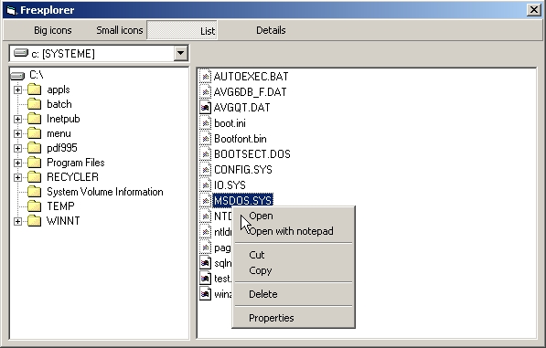



## Frexplorer \(File Explorer\) updated

### Description

Update 2003-08-15: Removed FileSystemObject, now I only use API which is a lot faster. 

----

Emulate Windows Explorer. Shows how to manipulate a treeview to build a directory tree, listview for files, API for file manipulation and recycle bin. I'm not responsible for what you do with it :)
 
### More Info
 

             |
---                |---
**Submitted On**   |2003-08-15 14:02:58
**By**             |[Frédéric Côté](https://github.com/Planet-Source-Code/PSCIndex/blob/master/ByAuthor/fr-d-ric-c-t.md)
**Level**          |Intermediate
**User Rating**    |5.0 (20 globes from 4 users)
**Compatibility**  |VB 6\.0
**Category**       |[Miscellaneous](https://github.com/Planet-Source-Code/PSCIndex/blob/master/ByCategory/miscellaneous__1-1.md)
**World**          |[Visual Basic](https://github.com/Planet-Source-Code/PSCIndex/blob/master/ByWorld/visual-basic.md)
**Archive File**   |[Frexplorer1630248152003\.zip](https://github.com/Planet-Source-Code/fr-d-ric-c-t-frexplorer-file-explorer-updated__1-40969/archive/master.zip)

